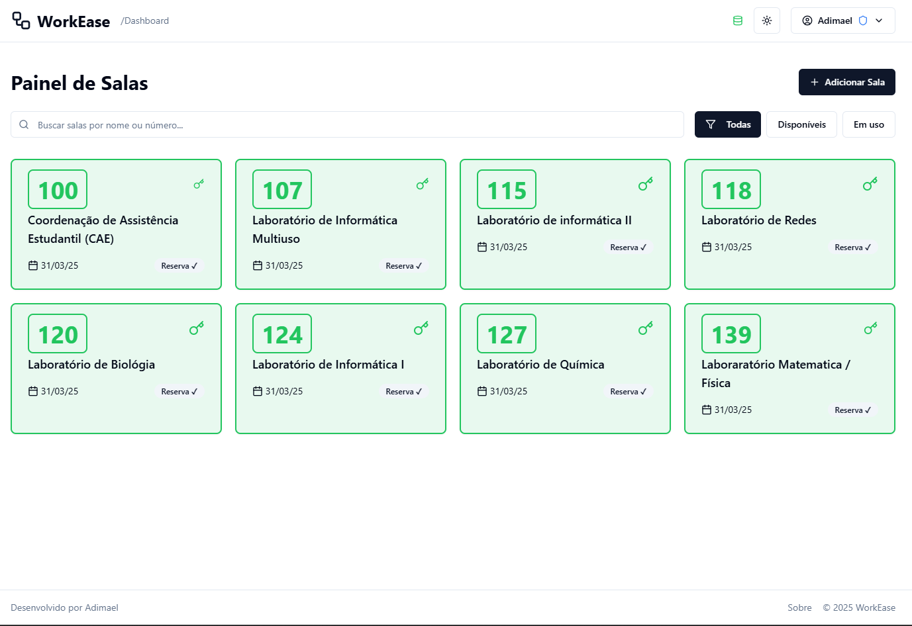
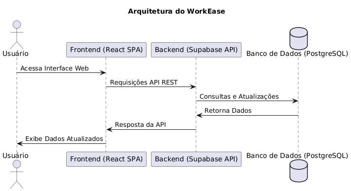
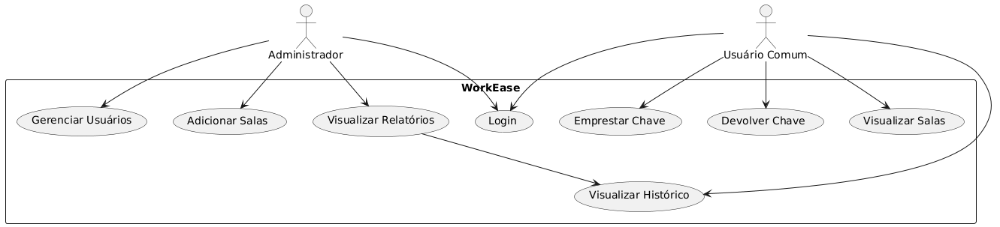
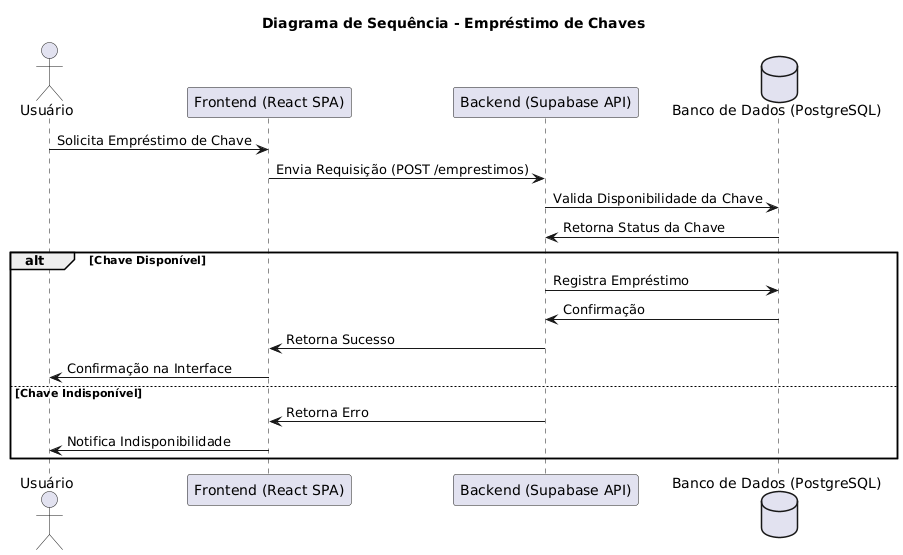

#  WorkEase - Gerenciamento de Chaves e Salas



## Índice

- [ WorkEase - Gerenciamento de Chaves e Salas](#-workease---gerenciamento-de-chaves-e-salas)
  - [Índice](#índice)
  - [Visão Geral](#visão-geral)
    - [Objetivo](#objetivo)
    - [Escopo](#escopo)
    - [Público-Alvo](#público-alvo)
  - [Arquitetura do Sistema](#arquitetura-do-sistema)
    - [Diagrama de Arquitetura](#diagrama-de-arquitetura)
    - [Tecnologias Utilizadas](#tecnologias-utilizadas)
      - [**Frontend**:](#frontend)
      - [**Backend**:](#backend)
    - [Fluxo de Dados](#fluxo-de-dados)
  - [Modelagem do Sistema](#modelagem-do-sistema)
    - [Diagramas UML](#diagramas-uml)
      - [**Diagrama de Caso de Uso**](#diagrama-de-caso-de-uso)
      - [**Diagrama de Classes**](#diagrama-de-classes)
      - [**Diagrama de Sequência**](#diagrama-de-sequência)
  - [Instalação e Configuração](#instalação-e-configuração)
    - [Pré-requisitos](#pré-requisitos)
    - [Passo a Passo da Instalação](#passo-a-passo-da-instalação)
    - [Execução do Projeto](#execução-do-projeto)
  - [Banco de Dados](#banco-de-dados)
    - [Modelo Relacional](#modelo-relacional)
    - [Consultas SQL Importantes](#consultas-sql-importantes)
      - [**Consulta de Histórico por Usuário**](#consulta-de-histórico-por-usuário)
      - [**Salas em Uso Atualmente**](#salas-em-uso-atualmente)
      - [**Estatísticas de Uso por Sala**](#estatísticas-de-uso-por-sala)
  - [Segurança](#segurança)
    - [Práticas de Segurança](#práticas-de-segurança)
  - [FAQ e Solução de Problemas](#faq-e-solução-de-problemas)

---

## Visão Geral

### Objetivo

O **WorkEase** é um sistema de gerenciamento de chaves e salas projetado para facilitar o controle de acesso a salas e espaços físicos em instituições educacionais, empresariais ou governamentais. Seu principal objetivo é rastrear quem está com qual chave, registrar históricos de uso e gerenciar a disponibilidade de chaves e salas.

### Escopo

O sistema abrange as seguintes funcionalidades principais:

- Gerenciamento de salas e chaves (adição, edição, remoção)
- Controle de empréstimo e devolução de chaves
- Registro de histórico de utilização
- Gerenciamento de usuários e perfis de acesso
- Geração de relatórios e estatísticas de uso
- Interface administrativa para configurações do sistema

> **Nota:** O sistema **não** inclui controle de acesso físico (fechaduras eletrônicas), mas pode ser integrado a esses sistemas em versões futuras.

### Público-Alvo

Esta documentação é destinada a:

- **Desenvolvedores:** Para compreender a arquitetura, realizar manutenções e extensões
- **Administradores de sistema:** Para instalação, configuração e manutenção
- **Gestores:** Para entender as capacidades e limitações do sistema
- **Usuários finais:** Seções específicas para operação do sistema

---

## Arquitetura do Sistema

### Diagrama de Arquitetura



```
@startuml
title Arquitetura do WorkEase

actor "Usuário" as User
participant "Frontend (React SPA)" as Frontend
participant "Backend (Supabase API)" as Backend
database "Banco de Dados (PostgreSQL)" as Database

User -> Frontend: Acessa Interface Web
Frontend -> Backend: Requisições API REST
Backend -> Database: Consultas e Atualizações

Backend <- Database: Retorna Dados
Frontend <- Backend: Resposta da API
User <- Frontend: Exibe Dados Atualizados

@enduml

```

O sistema segue uma arquitetura de aplicação web moderna baseada em uma SPA (Single Page Application) com comunicação via API RESTful.

### Tecnologias Utilizadas

#### **Frontend**:
- React (biblioteca JavaScript UI)
- TypeScript (tipagem estática)
- Vite (bundler e dev server)
- Tailwind CSS (framework CSS)
- shadcn/ui (componentes UI reutilizáveis)
- React Router (roteamento)
- React Query (gerenciamento de estado e cache)
- Lucide React (biblioteca de ícones)
- Recharts (visualização de dados)

#### **Backend**:
- Supabase (plataforma de desenvolvimento)
- PostgreSQL (banco de dados relacional)
- Row Level Security (segurança em nível de linha)
- Edge Functions (processamento serverless)
- Autenticação JWT (gerenciamento de sessão)

### Fluxo de Dados

1. O usuário interage com a interface React
2. Os componentes React acionam hooks personalizados
3. Os hooks utilizam React Query para buscar/modificar dados
4. React Query se comunica com o cliente Supabase
5. Supabase gerencia autenticação, autorização e validação de dados
6. O banco de dados PostgreSQL armazena e processa os dados
7. Supabase aplica regras RLS antes de retornar os resultados
8. React Query armazena os resultados em cache para acesso rápido
9. Os componentes React são atualizados com os dados novos

---

## Modelagem do Sistema

### Diagramas UML

#### **Diagrama de Caso de Uso**



#### **Diagrama de Classes**


#### **Diagrama de Sequência**



````
@startuml
title Diagrama de Sequência - Empréstimo de Chaves

actor Usuário
participant "Frontend (React SPA)" as Frontend
participant "Backend (Supabase API)" as Backend
database "Banco de Dados (PostgreSQL)" as Database

Usuário -> Frontend: Solicita Empréstimo de Chave
Frontend -> Backend: Envia Requisição (POST /emprestimos)
Backend -> Database: Valida Disponibilidade da Chave
Database -> Backend: Retorna Status da Chave
alt Chave Disponível
    Backend -> Database: Registra Empréstimo
    Database -> Backend: Confirmação
    Backend -> Frontend: Retorna Sucesso
    Frontend -> Usuário: Confirmação na Interface
else Chave Indisponível
    Backend -> Frontend: Retorna Erro
    Frontend -> Usuário: Notifica Indisponibilidade
end

@enduml

````

---

## Instalação e Configuração

### Pré-requisitos

- **Docker** e **Docker Compose** instalados

### Passo a Passo da Instalação

1. Clone o repositório:
   ```sh
   git clone https://github.com/WorkEase-Hub/workease-gerenciamento-chaves-docker.git
   ```
2. Acesse a pasta do projeto:
   ```sh
   cd workease-gerenciamento-chaves-docker
   ```
3. Suba os contêineres do projeto:
   ```sh
   docker-compose up -d
   ```

### Execução do Projeto

1. Após subir os contêineres, acesse o frontend via:
   ```
   http://localhost:8080/
   ```
2. O backend será gerenciado pelo Supabase

---

## Banco de Dados

### Modelo Relacional


### Consultas SQL Importantes

#### **Consulta de Histórico por Usuário**
```sql
SELECT * FROM historico_chaves WHERE usuario_id = 'ID_DO_USUARIO';
```

#### **Salas em Uso Atualmente**
```sql
SELECT * FROM salas WHERE disponivel = FALSE;
```

#### **Estatísticas de Uso por Sala**
```sql
SELECT sala_id, COUNT(*) AS total_emprestimos FROM historico_chaves GROUP BY sala_id;
```

---

## Segurança

### Práticas de Segurança
- Senhas com **hash bcrypt**
- Autenticação **JWT**
- Regras de acesso **RLS no Supabase**

---

## FAQ e Solução de Problemas

Caso encontre problemas, consulte a seção de **FAQ** ou abra uma **issue** no repositório. 🚀
